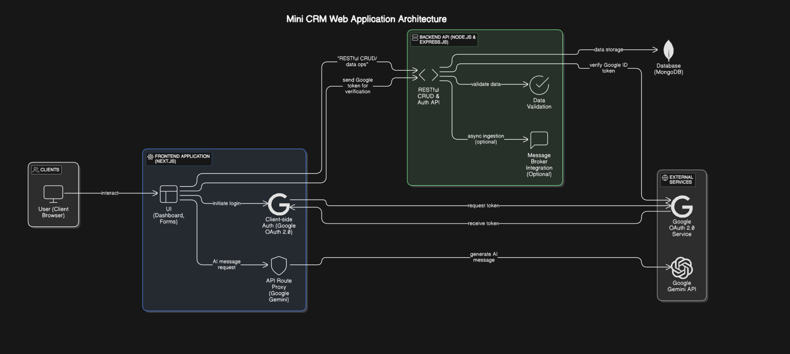

# Mini CRM Platform - Xeno SDE Internship Assignment 2025

This project is a Mini CRM Platform built as part of the Xeno SDE Internship Assignment. It enables customer segmentation, personalized campaign delivery, and incorporates AI-powered features.

🚀 **Assignment Goal:** Build a Mini CRM Platform that enables customer segmentation, personalized campaign delivery, and intelligent insights using modern tools and approaches.

---

## Table of Contents

1.  [Live Demo](#live-demo)
2.  [Demo Video](#demo-video)
3.  [Features Implemented](#features-implemented)
4.  [Tech Stack](#tech-stack)
5.  [Architecture Diagram](#architecture-diagram)
6.  [Getting Started](#getting-started)
    *   [Prerequisites](#prerequisites)
    *   [Backend Setup](#backend-setup)
    *   [Frontend Setup](#frontend-setup)
7.  [API Documentation](#api-documentation)
8.  [AI Integration](#ai-integration)
9.  [Known Limitations & Assumptions](#known-limitations--assumptions)
10. [Future Scope](#future-scope)

---

## Live Demo

[Live Link](https://google.com)

---

## Demo Video

[Demo Video Link](https://www.youtube.com/) 

---

## Features Implemented

*   **Data Ingestion APIs:**
    *   Secure REST APIs for ingesting customer and order data via CSV uploads.
    *   Backend validation of uploaded data.
    *   Swagger UI for API documentation and testing.
*   **Campaign Creation UI:**
    *   **Audience Segmentation:**
        *   Define audience segments using flexible rule logic (e.g., `spend > 10000 AND visits < 3`).
        *   Combine conditions using AND/OR logic.
        *   Dynamic rule builder for creating segment conditions (field, operator, value).
    *   **Campaign Definition:**
        *   Create campaigns with a name, message content, and optional intent.
        *   Link campaigns to pre-defined audience segment rules.
        *   Select specific customers for a campaign.
*   **Authentication:**
    *   Google OAuth 2.0 based authentication for secure access.
    *   Ensures only logged-in users can create audiences or view/manage campaigns.
*   **AI Integration:**
    *   **AI-Driven Message Suggestions:**
        *   Generate personalized campaign message variants using Google Gemini.
        *   Users can trigger AI message generation based on campaign name and selected audience rules.
*   **Core CRM Functionality:**
    *   Listing and viewing customer data.
    *   Creating and listing segment rules.

---

## Tech Stack

*   **Frontend:**
    *   Next.js (v15+ with App Router)
    *   React (v19+)
    *   TypeScript
    *   Ant Design (for UI components)
    *   Tailwind CSS (for styling)
    *   Zustand (for global state management - e.g., authentication)
*   **Backend:**
    *   Node.js
    *   Express.js
    *   TypeScript
    *   MongoDB (with Mongoose ODM)
*   **Authentication:**
    *   Google OAuth 2.0
    *   JSON Web Tokens (JWTs) for session management (implicitly via Google ID token verification).
*   **API Documentation:**
    *   Swagger (OpenAPI)
*   **AI:**
    *   Google Gemini API (for message generation)
*   **Development Tools:**
    *   VS Code
    *   Git & GitHub

---

## Architecture Diagram




A high-level overview:
*   **Client (Browser):** User interacts with the Next.js frontend.
*   **Frontend (Next.js Server):** Serves the React application, handles client-side routing, and makes API calls to the backend. Also includes Next.js API routes for specific frontend needs (e.g., AI message generation proxy).
*   **Backend (Node.js/Express API):** Handles business logic, data validation, database interactions, and authentication.
*   **Database (MongoDB):** Stores customer data, orders, segment rules, campaigns, users, and delivery logs.
*   **Google OAuth 2.0:** For user authentication.
*   **External AI Service (Gemini):** Called by the backend (or a secure frontend API route) for AI features.

---

## Getting Started

Follow these instructions to set up and run the project locally.

### Prerequisites

*   Node.js (v18.x or later recommended)
*   npm (v9.x or later) or yarn
*   MongoDB instance (local or a cloud-hosted version like MongoDB Atlas)
*   Google Cloud Platform project with OAuth 2.0 credentials enabled.

### Backend Setup

1.  **Navigate to the backend directory:**
    ```bash
    cd backend
    ```

2.  **Install dependencies:**
    ```bash
    npm install
    # or
    yarn install
    ```

3.  **Set up environment variables:**
    Create a `.env` file in the `backend` directory by copying `.env.example` (if provided, otherwise create it manually):
    ```
    PORT=5001 # Or any port you prefer
    MONGO_URI=your_mongodb_connection_string
    JWT_SECRET=your_strong_jwt_secret_key # For any custom JWTs if used beyond Google token
    GOOGLE_CLIENT_ID=your_google_oauth_client_id
    GOOGLE_CLIENT_SECRET=your_google_oauth_client_secret
    # Add any other backend-specific variables
    ```
    Replace placeholders with your actual credentials.

4.  **Run the backend server:**
    ```bash
    npm run dev
    ```
    The backend server should start, typically on `http://localhost:5001`.

### Frontend Setup

1.  **Navigate to the frontend directory:**
    ```bash
    cd frontend
    ```

2.  **Install dependencies:**
    ```bash
    npm install
    # or
    yarn install
    ```

3.  **Set up environment variables:**
    Create a `.env.local` file in the `frontend` directory:
    ```
    NEXT_PUBLIC_GOOGLE_CLIENT_ID=your_google_oauth_client_id
    NEXT_PUBLIC_BACKEND_URL=http://localhost:5001 # Or your backend's URL if different

    # For AI message generation via Next.js API route
    GEMINI_API_KEY=your_google_gemini_api_key
    ```
    Replace placeholders with your actual credentials. Ensure the `GOOGLE_CLIENT_ID` here is the same as the one used for the backend if you are verifying tokens on both sides or if the frontend directly interacts with Google for the token.

4.  **Run the frontend development server:**
    ```bash
    npm run dev
    ```
    The frontend application should start, typically on `http://localhost:3000`.

---

## API Documentation

The backend API is documented using Swagger (OpenAPI). Once the backend server is running, you can access the Swagger UI at:
`http://localhost:5001/api-docs` (or your backend URL + `/api-docs`)

This interface allows you to view all available API endpoints, their request/response schemas, and test them directly.

---

## AI Integration

*   **AI-Driven Message Suggestions:**
    *   The platform integrates with Google Gemini to provide AI-powered message suggestions for campaigns.
    *   When creating a campaign, users can click a button to "Generate Message with AI".
    *   The frontend sends the campaign name and a sanitized version of the selected segment rule to a Next.js API route (`/api/generateGeminiMessage`).
    *   This API route then calls the Google Gemini API with a prompt constructed from this information.
    *   The generated message is returned to the frontend and populated into the message content field.
    *   The `GEMINI_API_KEY` environment variable in the frontend's `.env.local` is used for this feature.

---

## Known Limitations & Assumptions

*   **Pub-Sub for Data Ingestion:** The brownie point for implementing a pub-sub architecture (Kafka, RabbitMQ, etc.) for asynchronous data persistence is not implemented. Data ingestion currently happens synchronously.
*   **Audience Size Preview:** The feature to preview audience size before saving a segment is not implemented.
*   **Campaign History Page:** A comprehensive campaign history page with detailed delivery stats (sent, failed, audience size) and sorting is not yet fully implemented.
*   **Campaign Delivery & Logging:**
    *   The complete end-to-end campaign delivery flow (sending personalized messages via a dummy vendor API, simulating success/failure, vendor API callback to a delivery receipt API, and batch updates to the communication log) is not fully implemented.
    *   The `DeliveryLog` model exists, but the full lifecycle isn't wired up.
*   **AI Features:** AI integration is currently limited to message suggestions. Other suggested AI use cases (Natural Language to Segment Rules, Performance Summarization, etc.) are not implemented.
*   **Error Handling:** While basic error handling is in place, more granular error feedback to the user and comprehensive backend logging could be improved.
*   **Testing:** No automated unit or integration tests are included in the current version.
*   **UX Enhancements:** Advanced UX features like drag-and-drop rule builders are not implemented; the UI uses standard form components.

---

## Future Scope

*   Implement the full campaign delivery and logging lifecycle as per the SRS.
*   Develop the campaign history page with detailed statistics.
*   Add the audience size preview feature.
*   Explore and implement a pub-sub architecture for scalable data ingestion.
*   Integrate more AI-powered features (e.g., natural language to segment rules, campaign performance summarization).
*   Enhance UX/UI with more interactive elements.
*   Implement comprehensive automated testing (unit, integration, e2e).
*   Improve error handling and system logging.

---

Thank you for the opportunity to work on this assignment!